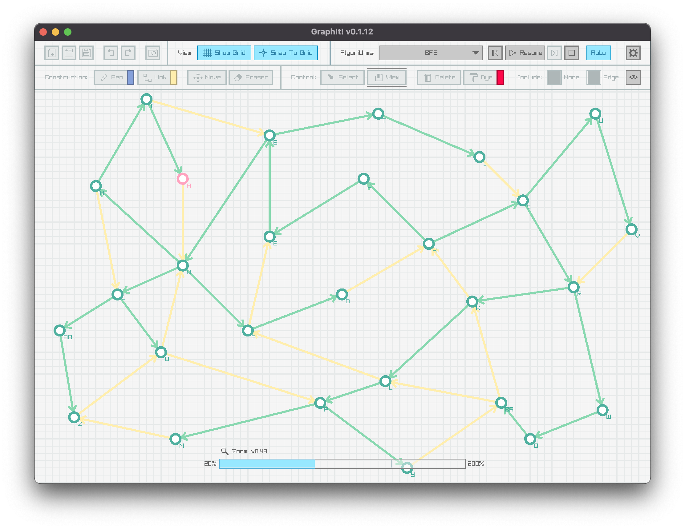
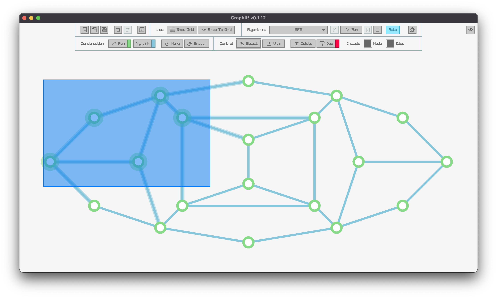
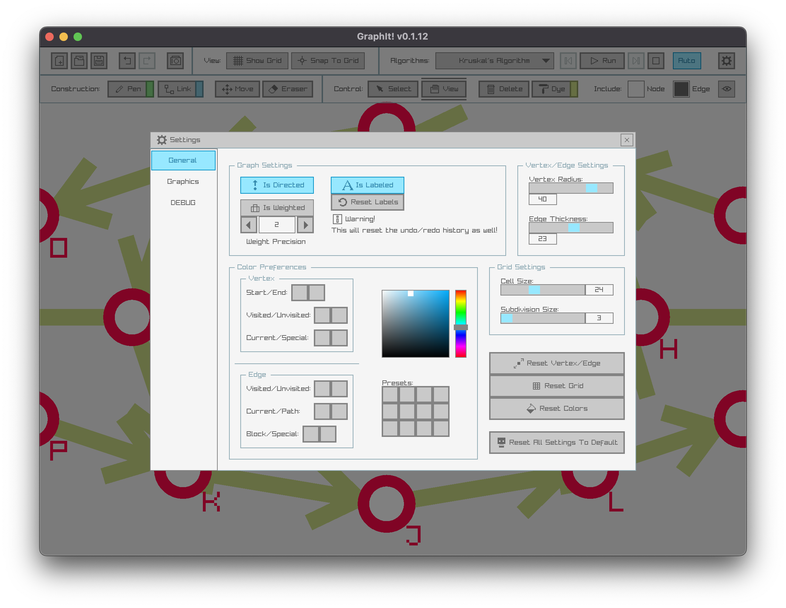

## GraphIt!

A simple program to build and visualize graphs and algorithms like BFS and MST.





### Features

- Visualize popular graph algorithms
- Customizable vertex radius, edge thickness, and colors
- Toggle grid, snap to grid, and label options
- Take PNG screenshots of your current graph
- Save and load graphs for later editing

### Build

```bash
mkdir build && cd build
cmake ..
make
```

**Dependencies:**

- [raylib](https://www.raylib.com/)
- C++20 compiler